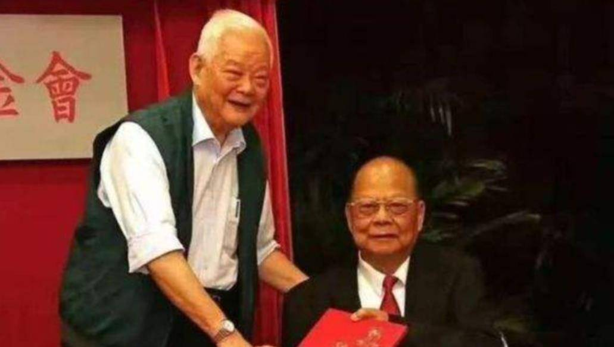
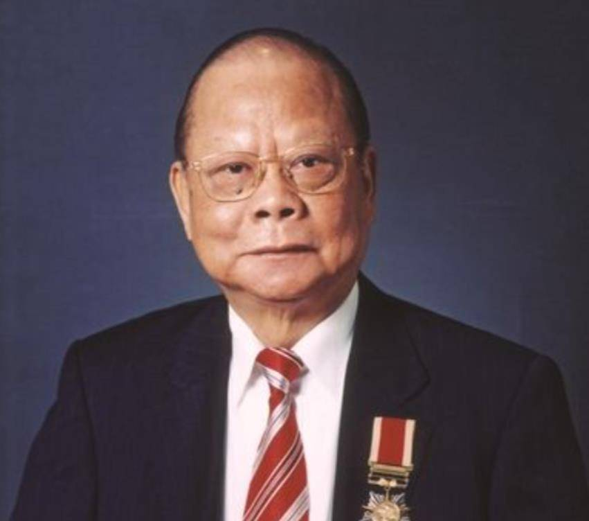
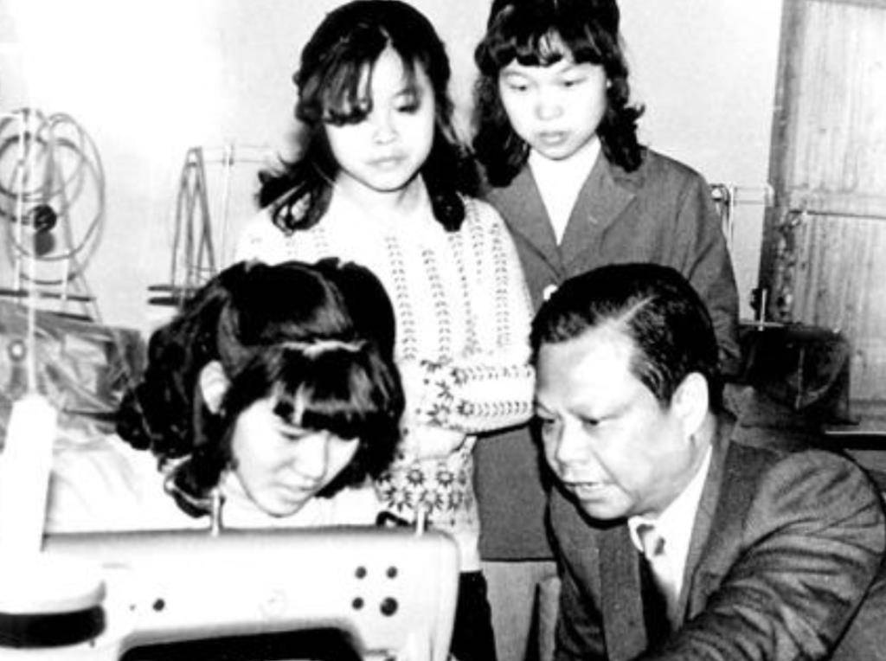
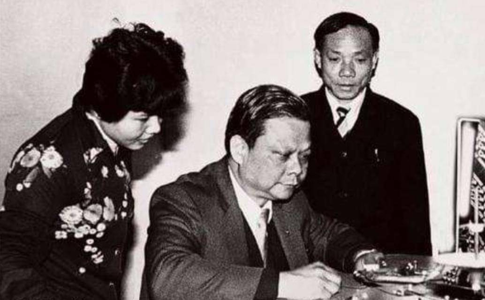
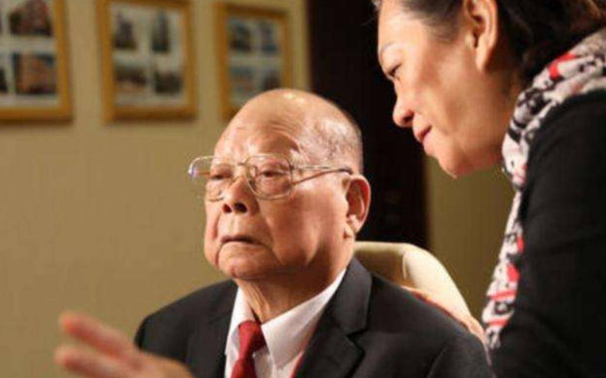
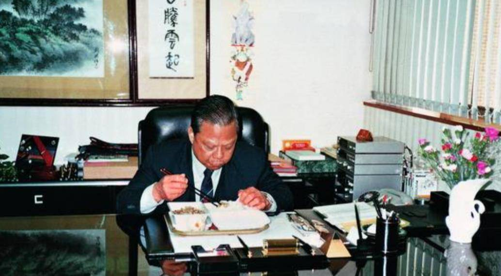
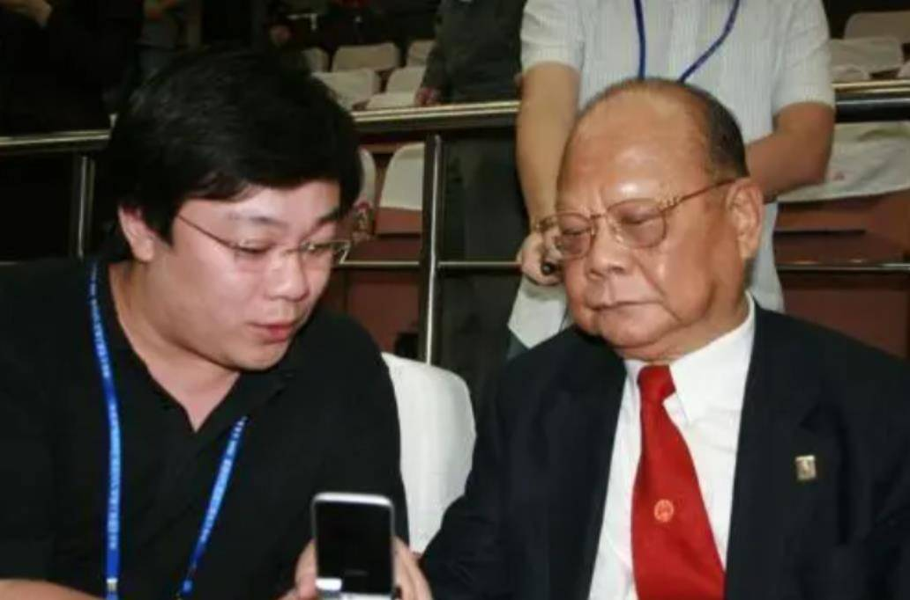
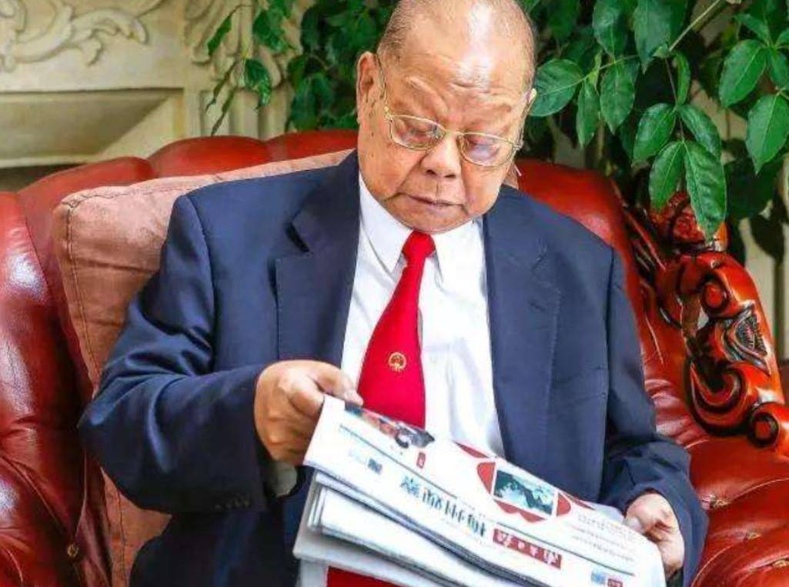
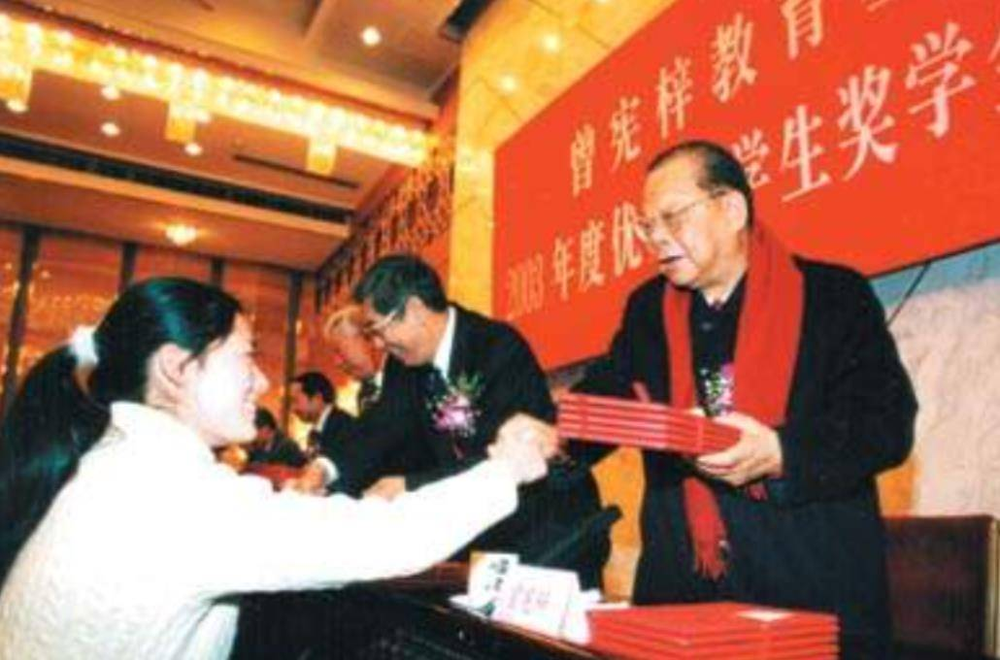

# 曾宪梓-香港金利来集团创始人介绍

创业

曾宪梓出生于1934年的广东梅州，是汉族客家人，那时候正值国家最危险的时期，曾宪梓的幼年几乎就是在这片动荡的时期度过，饥饿、贫穷还有死亡就是曾宪梓对于这个世界的初次影响。

但是紧跟着，国家的团结还有红色的反抗思想，也在深深地影响着他，他坚信国家会有出路，他也一样。他把所有的心事都放在了读书上，想要在书中，为自己谋取一线生机。

而幸运的是，他找到了，并且国家还给了这群孩子，一次重新选择命运的机会，国家恢复了高考，无数人背负着梦想走进大学，在埋头苦读四年后，带着对新社会的期待，在1961年，曾宪梓从学校毕业。

但是现实也并不如曾宪梓想象得那么平坦，从1963年到1968年期间，他去过香港，到过泰国，这是他最迷茫也是最无助的时候，他从事了很多份工作，甚至还担任过保姆，但是依旧两手空空。

在挣扎许久之后，曾宪梓再也无法忍受这份在异国他乡漂泊的感觉，他选择回到了香港，这不该是他的结束，而应该是他的开始，或许他该试着放手一搏了。

摒弃了之前畏手畏脚的心态，曾宪梓坚定了自己想要创业的决心，白天的工作结束之后，过了晚饭时间，曾宪梓便开始利用自己的闲暇时间去研究当前的市场状况，他需要找到一款适合自己创业的产品。

那时候的香港其实已经非常发达，人们的穿着也越来越讲究，西装开始成为男人们觉得“有面子”的标志，可是再仔细研究下去，却发现真正的领带加工厂却没有几家。

敏锐的曾宪梓感觉到，自己一直在寻觅的那一片蓝海，可能就是这里了，机会不等人，在谨慎地计算了一番后，曾宪梓拿上叔叔资助的6000块，腾空了自己的租房，一个简单的加工厂雏形就有了。

屡出奇招

因为资金有限，期初的时候，曾宪梓夫妻俩就算是起早贪黑，也只能做一些比较低价的领带，可就是因为此，销量非常差，资金也消耗了不少，看着那些废弃的材料，夫妻俩陷入难题。

如果继续做低端产品，可能回本勉强可以，但是想要赚钱，那基本是不可能的，可如果做高端产品，他们势必也要再搭一些钱过去，到时候赚不赚钱，可就不好说了。

曾宪梓没有思考多久，拍板定案，做。为了能让自己做出那种像模像样的高端领带，曾宪梓还专门从法国瑞士购买了一批领带，作为模板之后，开始了自己的模仿之路。

而一开始的曾宪梓，并没有想到赚钱，而是把这批领带放到商店，免费供应给客户，再打开销路，笼络了第一批客户，也顺便摸清楚了客户们更喜欢的款式和纹路。

有了目标之后，曾宪梓根据市场需求开始生产，没多少时间产品就售罄了，渐渐地，曾宪梓也在香港拥有了一些人气，等到了1970年，曾宪梓的名字，就是领带是否能畅销的一个有力保证。

在1971年，金利来创立。但是好景不长，到了1974年，香港的经济全面陷入低迷，曾宪梓还没有迎来与自己势均力敌的同行，就遭到了市场的降维打击。

不少人都认为，这个才兴起没多久的产业，或许就要撑不下去了。不少产业都在低调的球生存，而金利来却在这个时候，再次走出自己不同寻常的一步，他开始全面涨价了。

不少人对于此举都感到有些疑惑，本来不降价想要卖出去就已经很难了，金利来居然还要涨价，这是个什么操作？然后更让人迷惑的事情来，那些买家们，竟然吃这一套，金利来的销量反而好了起来。

个人贡献

金利来不仅漂漂亮亮地度过了这个经济萧条的时期，在这段低迷期过去之后，还把自己的品牌往更高端的方向推了一步，也是从这个时候开始，不少人开始有了这样的印象，金利来就是高端品牌的象征。

而此刻的曾宪梓也不再单独执着于领带这一行业，从男性钱包到皮带甚至是衣物等，全部囊括其中，公司的产品越来越多元化，彻底打响了那一句“金利来，男人的世界”。

在完全巩固了香港市场之后，曾宪梓开始不急不缓地往海外世界走着，从新加坡到马来西亚，甚至还有泰国，都有着曾宪梓与金利来的身影，大型的客户数量，也已经高达上千个。

或许也是因为在海外拓展客户的这段时间，金利来开始渐渐在年轻一辈的孩子视野中淡化了， 金利来也渐渐有了一种已经“老年化”的标签。

等到1996年的时候，儿子曾智明与黎瑞恩拍拖遭到曾宪梓的极力反对，这一家人才又重新出现在我们的视线之中，但是最后曾宪梓也没能拗过孩子，曾智明与黎瑞恩在2002年完婚。

曾宪梓的一生非常低调，但是在2012年的年底，却做了一件非常轰动的承诺，他说自己虽然没有多少钱，但是用自己的一点绵薄之力来支持国家，但那是大家都并不在意，只以为这不过是官场话。

但是一部分有心人却发现，在这些年来，曾宪梓光是在国家不同项目上的捐赠，就达到超过十亿元，每年用到家乡梅州的建设，更是多达到50万元，

结语

到了2019年，这位曾获得改革先锋称号的曾宪梓先生因病去世，享年85岁，最后葬于梅州，而自己最后的25亿财产，也全部捐献给了国家。